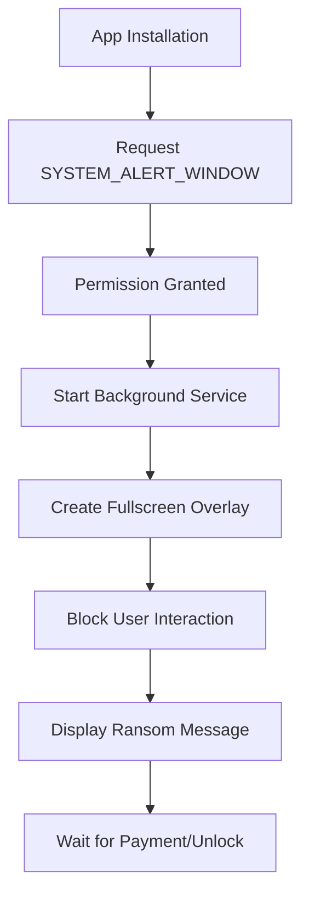

# PhalanxScreen - Educational Ransomware Analysis Tool


## ⚠️ DISCLAIMER / PERINGATAN

```
🔴 HANYA UNTUK TUJUAN EDUKASI
🔴 EDUCATIONAL PURPOSES ONLY
🔴 TIDAK UNTUK AKTIVITAS ILEGAL
🔴 NOT FOR ILLEGAL ACTIVITIES
```

**Tool ini dibuat semata-mata untuk tujuan edukasi dan penelitian keamanan siber. Penggunaan untuk tujuan jahat atau ilegal adalah tanggung jawab pengguna sepenuhnya.**

---

## 📋 Daftar Isi

- [Pembukaan](#pembukaan)
- [Apa itu PhalanxScreen?](#apa-itu-phalanxscreen)
- [Cara Kerja Ransomware](#cara-kerja-ransomware)
- [Instalasi dan Penggunaan](#instalasi-dan-penggunaan)
- [Kontributor](#kontributor)
- [Disclaimer Legal](#disclaimer-legal)

---

## 🎯 Pembukaan

Selamat datang di **PhalanxScreen Educational Tool** - sebuah proyek edukasi yang dirancang untuk memahami cara kerja ransomware tipe screen locker pada platform Android. Tool ini menggunakan permission `SYSTEM_ALERT_WINDOW` untuk mendemonstrasikan bagaimana malware dapat mengambil alih layar perangkat Android.

### Mengapa Tool Ini Dibuat?

- 📚 **Edukasi Keamanan Siber**: Membantu peneliti dan mahasiswa memahami cara kerja ransomware
- 🔍 **Analisis Malware**: Menyediakan contoh nyata untuk analisis behavior malware
- 🛡️ **Awareness**: Meningkatkan kesadaran tentang ancaman ransomware di Android
- 🧪 **Research**: Mendukung penelitian dalam bidang mobile security

---

## 🦠 Apa itu PhalanxScreen?

**PhalanxScreen** adalah simulasi ransomware tipe **Screen Locker** yang memanfaatkan permission `SYSTEM_ALERT_WINDOW` untuk mengunci layar perangkat Android. Berbeda dengan ransomware enkripsi yang mengenkripsi file, screen locker hanya memblokir akses ke interface pengguna.

### Karakteristik PhalanxScreen:

| Fitur | Deskripsi |
|-------|-----------|
| **Tipe** | Screen Locker Ransomware |
| **Target** | Android < 8.0 (API Level < 26) |
| **Permission** | SYSTEM_ALERT_WINDOW |
| **Metode** | Overlay Window Attack |
| **Persistensi** | Service Background |

### Mengapa Efektif di Android < 8?

🔹 **Permission Model Lama**: Android versi lama memiliki kontrol permission yang lebih lemah  
🔹 **SYSTEM_ALERT_WINDOW**: Permission ini memberikan akses luas untuk membuat overlay  
🔹 **Background Service**: Layanan dapat berjalan tanpa batasan ketat  
🔹 **User Awareness**: Pengguna Android lama kurang aware terhadap permission berbahaya

---

## ⚙️ Cara Kerja Ransomware

### Alur Kerja PhalanxScreen:



### Teknis Implementation:

1. **Phase 1 - Permission Acquisition**
   ```xml
   <uses-permission android:name="android.permission.SYSTEM_ALERT_WINDOW" />
   ```

2. **Phase 2 - Service Creation**
   - Membuat service yang berjalan di background
   - Service tidak dapat dihentikan dengan mudah oleh user

3. **Phase 3 - Overlay Attack**
   - Membuat window overlay yang menutupi seluruh layar
   - Menggunakan `TYPE_SYSTEM_ALERT` atau `TYPE_SYSTEM_OVERLAY`

4. **Phase 4 - User Interaction Block**
   - Menangkap semua input user (touch, back button, home button)
   - Mencegah akses ke aplikasi lain

---

## 🔧 Instalasi dan Penggunaan

### Prerequisites
- Android device dengan versi < 8.0
- Enable "Unknown Sources" di Security Settings
- Termux (optional untuk advanced testing)

### Langkah Instalasi

#### Text Guide 1: Basic Installation

```bash
# 1. Clone repository
git clone https://github.com/REYHAN6610/PhalanxLocks.git

# 2. Masuk ke direktori
cd PhalanxLocks

# 3. Build menggunakan Sketchware atau Android Studio
# File APK akan tersedia di folder /build/outputs/apk/

# 4. Install APK
adb install PhalanxScreen.apk

# 5. Jalankan aplikasi dan berikan permission SYSTEM_ALERT_WINDOW
```

#### Text Guide 2: Advanced Testing

```bash
# Testing dengan Termux
pkg update && pkg upgrade
pkg install android-tools

# Monitor log aktivitas
adb logcat | grep PhalanxScreen

# Debugging overlay window
adb shell dumpsys window windows | grep -E 'mCurrentFocus|mFocusedApp'

# Force stop jika terjadi masalah
adb shell am force-stop com.phalanx.screenlock
```

### Visual Guide

#### Gambar 1: Permission Request Flow
```
[Installation] → [Permission Dialog] → [SYSTEM_ALERT_WINDOW] → [Grant Access]
```
*Tampilan dialog permission yang akan muncul saat pertama kali menjalankan aplikasi*

#### Gambar 2: Active Overlay Screen
```
[Locked Screen Interface]
┌─────────────────────────────┐
│  🔒 DEVICE LOCKED BY         │
│     PHALANXSCREEN           │
│                             │
│  Your device has been       │
│  locked for educational     │
│  demonstration purposes     │
│                             │
│  [Enter Unlock Code]        │
│  [____________________]     │
│                             │
│  Educational Mode Active    │
└─────────────────────────────┘
```

#### Gambar 3: Background Service Monitor
```
[Service Management]
┌─────────────────────────────┐
│ Running Services:           │
│ ✅ PhalanxService           │
│ ⏱️  Runtime: 00:45:23        │
│ 🔋 Battery Usage: Low       │
│ 📊 Memory: 15MB             │
│                             │
│ [Stop Service] [Restart]    │
└─────────────────────────────┘
```

---

## 🤝 Kontributor

Terima kasih kepada semua platform dan tools yang memungkinkan pengembangan project edukasi ini:

<div align="center">

### Development Tools
[](https://sketchware.io)
[](https://github.com)
[](https://termux.com)
[](https://deepseek.com)

</div>

### Peran Masing-masing:

| Platform | Kontribusi |
|----------|------------|
| **Sketchware** | IDE utama untuk pengembangan aplikasi Android |
| **GitHub** | Version control dan hosting repository |
| **Termux** | Testing environment dan debugging tools |
| **DeepSeek** | AI assistance untuk dokumentasi dan coding |

---

## 📜 Disclaimer Legal

### ⚖️ Ketentuan Penggunaan

1. **Tujuan Edukasi Murni**: Tool ini dibuat untuk pembelajaran dan penelitian akademik
2. **Larangan Penggunaan Jahat**: Dilarang keras menggunakan untuk aktivitas illegal
3. **Tanggung Jawab Pengguna**: Developer tidak bertanggung jawab atas penyalahgunaan
4. **Compliance**: Pastikan penggunaan sesuai dengan hukum setempat
5. **Ethical Use**: Gunakan hanya pada device sendiri atau dengan izin explicit

### 🔒 Keamanan dan Privasi

- Tool ini tidak mengumpulkan data pribadi
- Tidak ada koneksi ke server external
- Semua aktivitas bersifat lokal
- Kode source tersedia untuk audit

### 📞 Kontak dan Support

Jika ada pertanyaan terkait penggunaan edukatif:

- **Repository Issues**: [GitHub Issues](https://github.com/REYHAN6610/PhalanxLocks/issues)
- **Email**: educational.security@example.com
- **Educational Purpose Only**: Untuk keperluan penelitian akademik

---

## 📊 Statistics


---

<div align="center">

**⚠️ REMEMBER: Use Responsibly for Educational Purposes Only ⚠️**

*"With great power comes great responsibility" - Use this knowledge to protect, not to harm*

</div>
