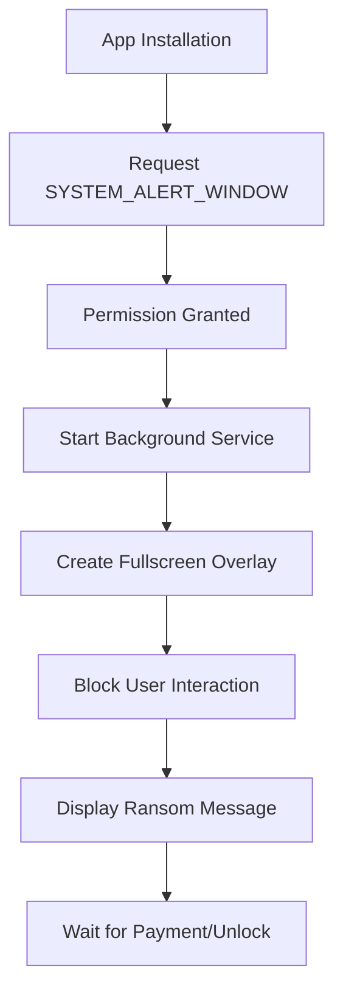

# PhalanxScreen - Educational Ransomware Simulation


---

## 🎯 Introduction


Welcome to **PhalanxScreen Educational Tool** - an educational project designed to understand how screen locker ransomware works on Android platform. This tool uses `SYSTEM_ALERT_WINDOW` permission to demonstrate how malware can take over Android device screens.

### Why This Tool Was Created?

- 📚 **Cybersecurity Education**: Help researchers and students understand how ransomware works
- 🔍 **Malware Analysis**: Provide real examples for malware behavior analysis
- 🛡️ **Awareness**: Increase awareness about ransomware threats on Android
- 🧪 **Research**: Support research in mobile security field

---

## 🦠 What is PhalanxScreen?

**PhalanxScreen** is a **Screen Locker** ransomware simulation that uses `SYSTEM_ALERT_WINDOW` permission to lock Android device screens. Unlike encryption ransomware that encrypts files, screen locker only blocks access to the user interface.

### PhalanxScreen Characteristics:

| Feature | Description |
|---------|-------------|
| **Type** | Screen Locker Ransomware |
| **Target** | Android < 8.0 (API Level < 26) |
| **Permission** | SYSTEM_ALERT_WINDOW |
| **Method** | Overlay Window Attack |
| **Persistence** | Background Service |

### Why Effective on Android < 8?

🔹 **Old Permission Model**: Older Android versions have weaker permission controls  
🔹 **SYSTEM_ALERT_WINDOW**: This permission provides broad access to create overlays  
🔹 **Background Service**: Services can run without strict limitations  
🔹 **User Awareness**: Older Android users are less aware of dangerous permissions

---

## ⚙️ How Ransomware Works

### PhalanxScreen Workflow:



### Technical Implementation:

1. **Phase 1 - Permission Acquisition**
   ```xml
   <uses-permission android:name="android.permission.SYSTEM_ALERT_WINDOW" />
   <uses-permission android:name="android.permission.POST_NOTIFICATIONS"/>
   ```

2. **Phase 2 - Service Creation**
   - Create a service that runs in the background
   - Service cannot be easily stopped by user

3. **Phase 3 - Overlay Attack**
   - Create window overlay that covers the entire screen
   - Using `TYPE_SYSTEM_ALERT` or `TYPE_SYSTEM_OVERLAY`

4. **Phase 4 - User Interaction Block**
   - Capture all user input (touch, back button, home button)
   - Prevent access to other applications

---

## 🔧 Installation and Usage

### Prerequisites
- Android device with version < 8.0
- Enable "Unknown Sources" in Security Settings
- Termux (optional for advanced testing)

### Installation Steps

#### Text Guide 1: Basic Installation

```bash
# 1. Clone repository
git clone https://github.com/REYHAN6610/PhalanxLocks

# 2. Enter directory
cd PhalanxLocks

# 3. Run python script
pip install -r hook.txt
python edit.py

# 4. Convert to application
Provide input sent by script
Open ApkTool M Convert to application

# 4. Edit Application
You can edit the application like


```

[Download ApkTool M](https://maximoff.su/apktool)
---

## ScreenShot + Tutorial

### After creating the application


### Open Apk tools M and find where you placed the BuildApp folder


### If it has been decompiled you can click the application


### Choose Quick edit so it can be edited


### Here you can edit like icon and application name freely


### If you are satisfied you can save if error using aapt can change to aapt2


---

## 🤝 Contributors

Thanks to all platforms and tools that made the development of this educational project possible:

<div align="center">

### Development Tools
[](https://sketchware.io)
[](https://github.com)
[](https://termux.com)
[](https://deepseek.com)

</div>

### Role of Each:

| Platform | Contribution |
|----------|-------------|
| **Sketchware** | Creating Ransomware on android |
| **GitHub** | Version control and repository hosting |
| **Termux** | For running and creating applications using python |
| **DeepSeek** | AI assistance for documentation and coding |

---

<div align="center">

**⚠️ REMEMBER: Use Responsibly for Educational Purposes Only ⚠️**

*"With great power comes great responsibility" - Use this knowledge to protect, not to harm*

</div>
